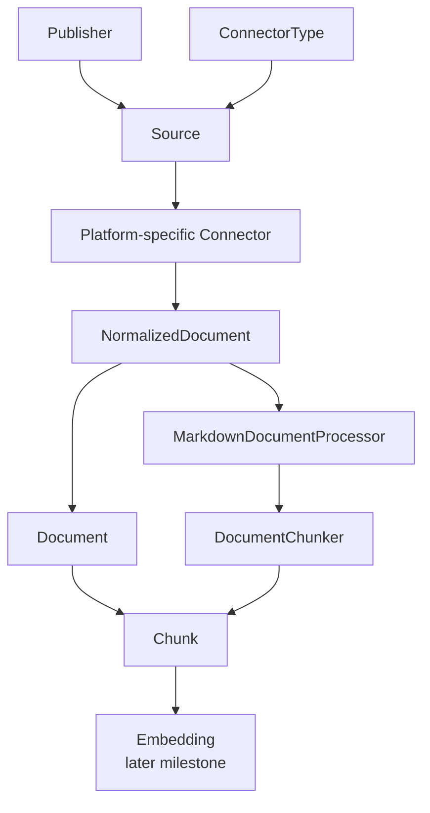

# Documentation Integrity

A local-first Java RAG project for diagnosing GitHub Actions problems with
measurable, cited answers over evidence-preserving product documentation.

The initial demonstration serves developers and DevOps engineers responsible
for CI/CD workflows. It uses the GitHub Actions documentation from the official
`github/docs` repository as its licensed knowledge corpus. The system is an
independent technical project and is not affiliated with, endorsed by, or
sponsored by GitHub.

## Problem

Diagnosing a GitHub Actions failure can require connecting workflow syntax,
secret propagation, token permissions, trigger behavior, and runner context
across several documentation pages. An AI chat interface can still conceal a
retrieval failure behind a fluent explanation. This project makes the proposed
root cause, supporting evidence, abstention, retrieval quality, and later corpus
freshness observable and testable.

Chat is the required v1 demonstration surface. A broader knowledge-quality
platform for changing documentation is a post-v1 hypothesis, not active scope.

## Current Status

This repository has an executable lexical-search slice. The table distinguishes
working capabilities from the next implementation targets.

**Active milestone:** M5 Source synchronization. M3 Publisher management and
M4 Source management are complete; M5 proves bounded, current-state
synchronization and its operator result. See [`CURRENT_FOCUS.md`](CURRENT_FOCUS.md)
for the active boundary.

| Capability | Status |
| --- | --- |
| Docker Compose with PostgreSQL/pgvector and Kafka | Implemented and verified locally |
| Java 25 Maven reactor and `api-service` health endpoint | Implemented and tested |
| Flyway schema migrations and PostgreSQL integration tests | Implemented and tested |
| Manual Markdown fixture import with hashes and citations | Implemented and tested |
| PostgreSQL full-text lookup with GIN index | Implemented and tested |
| Connector-neutral local-directory and file-upload acquisition | Implemented and integration-tested for single-document synchronization |
| Current-state document create, skip, and transactional replacement | Implemented and integration-tested |
| Operational ingestion-run status and failure reporting | Implemented and integration-tested |
| Complete source scans and stale-document deletion | Planned for the source-synchronization milestone |
| Kafka delivery | Conditional decision; not active |
| Hybrid retrieval, reranking, answer generation, and abstention | Planned |
| Evaluation suite and observability | Planned |
| React frontend foundation | Implemented and verified locally |
| Publisher management UI | Implemented and verified locally: list and create Publishers; no editing or deletion |
| Source management UI | Implemented and verified locally: list and create Sources for Publishers; no editing, deletion, or synchronization |
| Source synchronization UI | Active M5; implementation pending |
| Diagnostic chat UI | Planned with diagnosis behavior |
| Change, freshness, and contradiction detection | Later milestone |

## Technical Direction and Decision Gates

- Java 25, Spring Boot 4.x, Spring AI 2.0.0, and Maven
- React and TypeScript frontend
- PostgreSQL with pgvector, HNSW vector search, and GIN full-text search
- Ollama with `qwen3:8b` for answer generation
- ONNX Runtime with `nomic-embed-text` and `bge-reranker-v2-m3`
- Micrometer/OpenTelemetry instrumentation and a versioned evaluation dataset

Apache Kafka is a conditional candidate for durable asynchronous ingestion.
gRPC is a conditional candidate for a separately justified retrieval-service
boundary. Neither is authorized by its presence in the technical direction;
each requires an active milestone, an ADR, working failure semantics, and tests.

### Ingestion Domain Flow



## V1 Target Scenario

V1 is reached when a developer can submit a natural-language question together
with a workflow fragment or error message and receive an evidence-backed
diagnosis, relevant assumptions, a minimal corrective example when supported,
and direct source citations. If the provided context or documentation cannot
support a diagnosis, the system must ask for missing context or abstain.

Initial question categories include reusable workflows, secrets and
permissions, workflow triggers, `GITHUB_TOKEN`, runners, and deployment
environments.

## Knowledge Source Policy

Ingestion is limited to explicitly allowlisted sources whose automated access,
retention, and use are permitted. Public availability alone is not treated as
permission to crawl or store content. No third-party documentation corpus or
downloaded model is committed to this repository.

The ingestion core uses a connector-neutral document contract. The initial
corpus is the current GitHub.com variant of `content/actions/` from
the official [`github/docs`](https://github.com/github/docs) repository,
including referenced content from `data/reusables/`. That documentation is
licensed under CC BY 4.0. Referenced values from `data/variables/` are resolved
as part of rendering. The corpus is acquired from a pinned Git revision and
parsed locally; this project does not crawl `docs.github.com`.

The second v1 adapter accepts an operator-provided Markdown or text file to
prove that ingestion is not coupled to Git. Authenticated Jira and Google Docs
connectors are future extensions after permission, secret-handling, pagination,
and deletion semantics are designed and tested.

Every indexed document retains its stable source locator, canonical URL when
available, optional upstream version, content hash, product variant,
acquisition time, and attribution. Git-backed documents additionally retain
their repository and commit SHA. Synthetic or explicitly licensed fixtures are
used for automated tests and public CI.

## Local Infrastructure

Prerequisite: Docker Desktop.

```bash
docker compose -f infra/compose.yaml up -d
docker compose -f infra/compose.yaml ps
```

PostgreSQL is available on `localhost:5444`; Kafka is available on
`localhost:29092`.

## Planned Proof

The project will publish reproducible comparisons of full-text search, vector
search, hybrid retrieval, and hybrid retrieval with reranking. Results will
include retrieval quality, citation support, abstention behavior, latency, and
the exact dataset/model/configuration used.

## License

This project is licensed under the Apache License 2.0. See [LICENSE](LICENSE).
